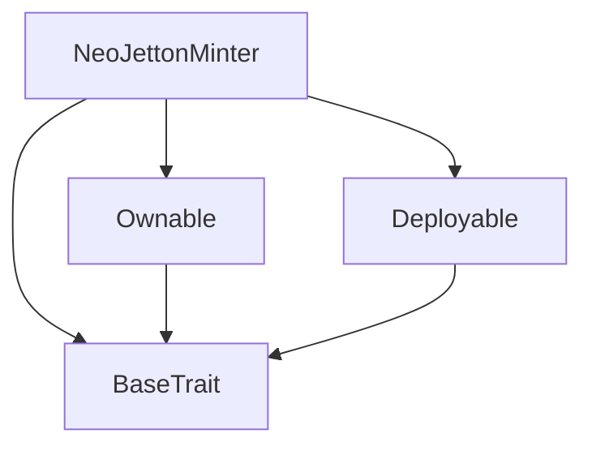
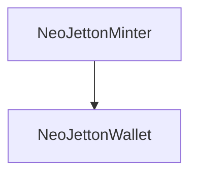

# Tact compilation report
Contract: NeoJettonMinter
BoC Size: 3779 bytes

## Structures (Structs and Messages)
Total structures: 37

### DataSize
TL-B: `_ cells:int257 bits:int257 refs:int257 = DataSize`
Signature: `DataSize{cells:int257,bits:int257,refs:int257}`

### SignedBundle
TL-B: `_ signature:fixed_bytes64 signedData:remainder<slice> = SignedBundle`
Signature: `SignedBundle{signature:fixed_bytes64,signedData:remainder<slice>}`

### StateInit
TL-B: `_ code:^cell data:^cell = StateInit`
Signature: `StateInit{code:^cell,data:^cell}`

### Context
TL-B: `_ bounceable:bool sender:address value:int257 raw:^slice = Context`
Signature: `Context{bounceable:bool,sender:address,value:int257,raw:^slice}`

### SendParameters
TL-B: `_ mode:int257 body:Maybe ^cell code:Maybe ^cell data:Maybe ^cell value:int257 to:address bounce:bool = SendParameters`
Signature: `SendParameters{mode:int257,body:Maybe ^cell,code:Maybe ^cell,data:Maybe ^cell,value:int257,to:address,bounce:bool}`

### MessageParameters
TL-B: `_ mode:int257 body:Maybe ^cell value:int257 to:address bounce:bool = MessageParameters`
Signature: `MessageParameters{mode:int257,body:Maybe ^cell,value:int257,to:address,bounce:bool}`

### DeployParameters
TL-B: `_ mode:int257 body:Maybe ^cell value:int257 bounce:bool init:StateInit{code:^cell,data:^cell} = DeployParameters`
Signature: `DeployParameters{mode:int257,body:Maybe ^cell,value:int257,bounce:bool,init:StateInit{code:^cell,data:^cell}}`

### StdAddress
TL-B: `_ workchain:int8 address:uint256 = StdAddress`
Signature: `StdAddress{workchain:int8,address:uint256}`

### VarAddress
TL-B: `_ workchain:int32 address:^slice = VarAddress`
Signature: `VarAddress{workchain:int32,address:^slice}`

### BasechainAddress
TL-B: `_ hash:Maybe int257 = BasechainAddress`
Signature: `BasechainAddress{hash:Maybe int257}`

### ChangeOwner
TL-B: `change_owner#819dbe99 queryId:uint64 newOwner:address = ChangeOwner`
Signature: `ChangeOwner{queryId:uint64,newOwner:address}`

### ChangeOwnerOk
TL-B: `change_owner_ok#327b2b4a queryId:uint64 newOwner:address = ChangeOwnerOk`
Signature: `ChangeOwnerOk{queryId:uint64,newOwner:address}`

### Deploy
TL-B: `deploy#946a98b6 queryId:uint64 = Deploy`
Signature: `Deploy{queryId:uint64}`

### DeployOk
TL-B: `deploy_ok#aff90f57 queryId:uint64 = DeployOk`
Signature: `DeployOk{queryId:uint64}`

### FactoryDeploy
TL-B: `factory_deploy#6d0ff13b queryId:uint64 cashback:address = FactoryDeploy`
Signature: `FactoryDeploy{queryId:uint64,cashback:address}`

### Transfer
TL-B: `transfer#75097f5d query_id:uint64 amount:coins destination:address response_destination:address custom_payload:Maybe ^cell forward_ton_amount:coins forward_payload:remainder<slice> = Transfer`
Signature: `Transfer{query_id:uint64,amount:coins,destination:address,response_destination:address,custom_payload:Maybe ^cell,forward_ton_amount:coins,forward_payload:remainder<slice>}`

### InternalTransfer
TL-B: `internal_transfer#05138d91 query_id:uint64 amount:coins from:address response_address:address forward_ton_amount:coins forward_payload:remainder<slice> = InternalTransfer`
Signature: `InternalTransfer{query_id:uint64,amount:coins,from:address,response_address:address,forward_ton_amount:coins,forward_payload:remainder<slice>}`

### TransferNotification
TL-B: `transfer_notification#7362d09c query_id:uint64 amount:coins sender:address forward_payload:remainder<slice> = TransferNotification`
Signature: `TransferNotification{query_id:uint64,amount:coins,sender:address,forward_payload:remainder<slice>}`

### Burn
TL-B: `burn#595f07bc query_id:uint64 amount:coins response_destination:address custom_payload:Maybe ^cell = Burn`
Signature: `Burn{query_id:uint64,amount:coins,response_destination:address,custom_payload:Maybe ^cell}`

### BurnNotification
TL-B: `burn_notification#7bdd97de query_id:uint64 amount:coins sender:address response_destination:address = BurnNotification`
Signature: `BurnNotification{query_id:uint64,amount:coins,sender:address,response_destination:address}`

### Excesses
TL-B: `excesses#d53276db query_id:uint64 = Excesses`
Signature: `Excesses{query_id:uint64}`

### DeployJetton
TL-B: `deploy_jetton#61caf729 owner:address content:^cell max_supply:coins mint_price:coins mint_amount:coins = DeployJetton`
Signature: `DeployJetton{owner:address,content:^cell,max_supply:coins,mint_price:coins,mint_amount:coins}`

### SetPublicMint
TL-B: `set_public_mint#12345678 enabled:bool = SetPublicMint`
Signature: `SetPublicMint{enabled:bool}`

### SetBridgeMinter
TL-B: `set_bridge_minter#87654321 address:address = SetBridgeMinter`
Signature: `SetBridgeMinter{address:address}`

### BridgeMint
TL-B: `bridge_mint#75111111 receiver:address amount:coins = BridgeMint`
Signature: `BridgeMint{receiver:address,amount:coins}`

### SetWalletPause
TL-B: `set_wallet_pause#11111111 paused:bool = SetWalletPause`
Signature: `SetWalletPause{paused:bool}`

### RequestWalletPause
TL-B: `request_wallet_pause#22222222 user:address paused:bool = RequestWalletPause`
Signature: `RequestWalletPause{user:address,paused:bool}`

### Pause
TL-B: `pause#10000001  = Pause`
Signature: `Pause{}`

### Unpause
TL-B: `unpause#10000002  = Unpause`
Signature: `Unpause{}`

### SetGuardian
TL-B: `set_guardian#10000003 address:address = SetGuardian`
Signature: `SetGuardian{address:address}`

### SetTreasury
TL-B: `set_treasury#10000004 address:address = SetTreasury`
Signature: `SetTreasury{address:address}`

### SetFee
TL-B: `set_fee#10000005 bps:int257 = SetFee`
Signature: `SetFee{bps:int257}`

### NeoJettonMinter$Data
TL-B: `_ total_supply:coins owner:address content:^cell max_supply:coins mint_price:coins mint_amount:coins public_mint_enabled:bool bridge_minter:address paused:bool guardian:address treasury:address fee_bps:int257 minters:dict<address, bool> = NeoJettonMinter`
Signature: `NeoJettonMinter{total_supply:coins,owner:address,content:^cell,max_supply:coins,mint_price:coins,mint_amount:coins,public_mint_enabled:bool,bridge_minter:address,paused:bool,guardian:address,treasury:address,fee_bps:int257,minters:dict<address, bool>}`

### JettonData
TL-B: `_ total_supply:int257 mintable:bool admin_address:address content:^cell wallet_code:^cell = JettonData`
Signature: `JettonData{total_supply:int257,mintable:bool,admin_address:address,content:^cell,wallet_code:^cell}`

### NeoJettonWallet$Data
TL-B: `_ balance:coins owner:address master:address paused:bool = NeoJettonWallet`
Signature: `NeoJettonWallet{balance:coins,owner:address,master:address,paused:bool}`

### WalletData
TL-B: `_ balance:int257 owner:address master:address paused:bool = WalletData`
Signature: `WalletData{balance:int257,owner:address,master:address,paused:bool}`

### NeoJettonFactory$Data
TL-B: `_ owner:address treasury:address guardian:address paused:bool fee_bps:int257 = NeoJettonFactory`
Signature: `NeoJettonFactory{owner:address,treasury:address,guardian:address,paused:bool,fee_bps:int257}`

## Get methods
Total get methods: 4

## get_jetton_data
No arguments

## get_wallet_address
Argument: owner

## is_paused
No arguments

## owner
No arguments

## Exit codes
* 2: Stack underflow
* 3: Stack overflow
* 4: Integer overflow
* 5: Integer out of expected range
* 6: Invalid opcode
* 7: Type check error
* 8: Cell overflow
* 9: Cell underflow
* 10: Dictionary error
* 11: 'Unknown' error
* 12: Fatal error
* 13: Out of gas error
* 14: Virtualization error
* 32: Action list is invalid
* 33: Action list is too long
* 34: Action is invalid or not supported
* 35: Invalid source address in outbound message
* 36: Invalid destination address in outbound message
* 37: Not enough Toncoin
* 38: Not enough extra currencies
* 39: Outbound message does not fit into a cell after rewriting
* 40: Cannot process a message
* 41: Library reference is null
* 42: Library change action error
* 43: Exceeded maximum number of cells in the library or the maximum depth of the Merkle tree
* 50: Account state size exceeded limits
* 128: Null reference exception
* 129: Invalid serialization prefix
* 130: Invalid incoming message
* 131: Constraints error
* 132: Access denied
* 133: Contract stopped
* 134: Invalid argument
* 135: Code of a contract was not found
* 136: Invalid standard address
* 138: Not a basechain address
* 1521: Only owner can unpause
* 4429: Invalid sender
* 4530: Invalid owner
* 5239: Insufficient TON for factory deploy
* 19792: Contract is paused
* 22615: Mint disabled
* 30491: Only master can pause wallets
* 36088: Invalid wallet
* 37411: Not authorized for bridge mint
* 42435: Not authorized
* 46136: Fee too high
* 47714: Max supply reached
* 49334: Invalid supply
* 51687: Already minted
* 53156: Insufficient TON for fees
* 54615: Insufficient balance
* 60484: Supply too high
* 61788: Factory is paused
* 63671: Wallet is paused

## Trait inheritance diagram

## Contract dependency diagram

